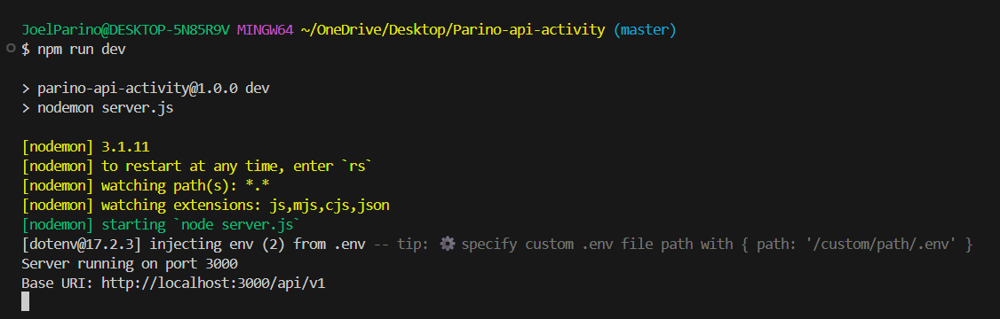
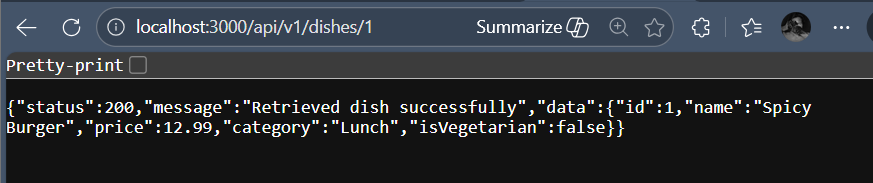

# RESTful API Activity - Joel Pariño

## Best Practices Implementation

### 1. Environment Variables
- **Why did we put `BASE_URI` in `.env` instead of hardcoding it?**  
  **Answer:**  
  We use `.env` so configuration values like `BASE_URI` and `PORT` can be changed without editing the source code. This keeps the code cleaner, easier to deploy in different environments (development vs production), and prevents mistakes from hardcoding URLs in multiple places.

### 2. Resource Modeling
- **Why did we use plural nouns (e.g., `/dishes`) for our routes?**  
  **Answer:**  
  Plural nouns represent a collection of resources. For example, `/dishes` means “all dishes,” and `/dishes/:id` means “one dish from the collection.” This follows REST conventions and makes endpoints predictable and consistent.

### 3. Status Codes
- **When do we use `201 Created` vs `200 OK`?**  
  **Answer:**  
  We use **`201 Created`** when the request successfully creates a new resource (e.g., `POST /dishes`). We use **`200 OK`** when the request successfully retrieves or updates data (e.g., `GET /dishes`, `GET /dishes/:id`, `PUT /dishes/:id`).

- **Why is it important to return `404` instead of just an empty array or a generic error?**  
  **Answer:**  
  `404 Not Found` clearly tells the client that the requested resource does not exist (e.g., dish ID not found). This is better than returning an empty array because it avoids confusion and helps developers or client applications handle errors properly.

## Testing

### Server Running Successfully

### GET All Dishes

### GET Dish by ID

